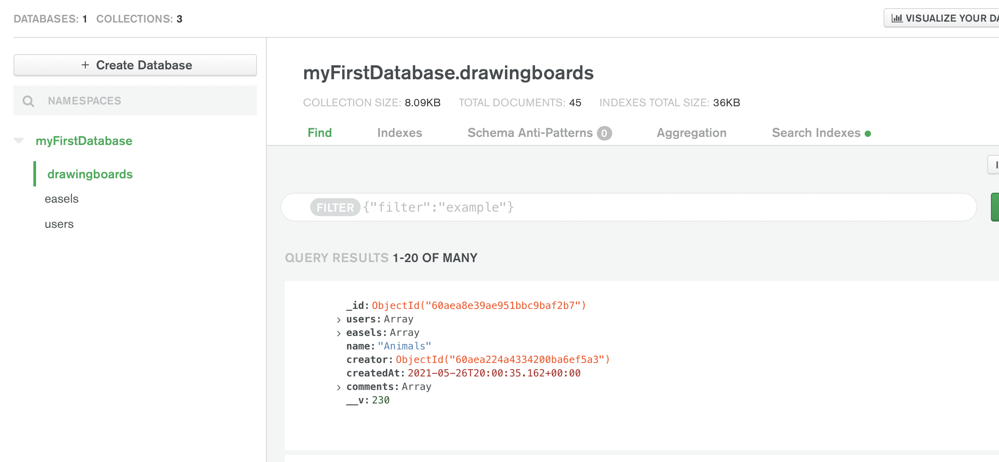
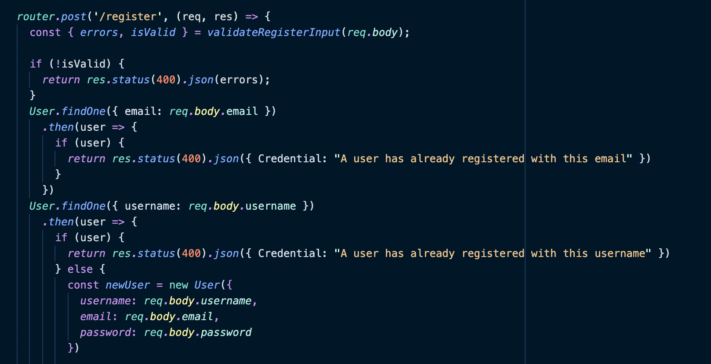

# Weeasel

[Link to live site](http://weeasel.herokuapp.com/#/)

## Overview
Weeasel is a collaborative drawing board application that allows users to chat and draw together in real time!

Weeasel bolsters a user-experience with great CRUD, a sleek and aesthetically charming user interface as well as an intelligible backend to handle and display user data.

The live app also facilitates an even better user experience by implementing a behind the scene save feature that lets you come back to your masterpiece as well as a chat section for each individual board.

## How does it work?

Users have the ability to create and login to their account where they will be prompted to create a drawing board. Each drawing board has its own chat room where logged in users can can draw and talk with friends. Boards can be kept private, or the creator can add others to work together.

Users have the ability to maintain a friends list by just clicking the plus sign next to friends located in the right side bar which shows all the users for the site. The friends list grants quick access to adding your most important collaborators to any new or existing board.

Once a drawing board is made you will be prompted to enter a name for your easel and begin on your masterpiece. An easel is the actual drawing being worked on, and a drawing board can have as many easels as necessary. This allows users to be working on several pieces at once and keep them together in a shared collection.

Now all thats left is to add friends to your board by clicking the icon next to your board name in the sidebar display. Happy Painting!!

## Who is it for?

The most sophisticated and well seasoned artists, or someone who just wants to have some fun with their friends! This applications is for all ages and skill levels.

## Technologies Used 

Weeasel is MERN-stack web application that also takes advantage of websockets. MERN handles all of the user data and visualization while Websockets allows for an almost instantaneous update time for clients connected to the server.

### Websockets 

The web app makes use of the 'socket.io' and 'socket.io client' dependencies. The first sets up a bi-directional communication system to our already established express server. The seconds allows us to establish a connection on the frontend to essentially just emit messages to the server and then to all clients connected.

### MERN Stack
The web app utilizes MongoDB, Express.js, React.js and Node.js. User's info as well as image data is stored using a non-relational database with documents while React renders everything to the screen through a single page model. 

## Implementation details

### Websockets

Once a client logs in they will immediately be connected to the server and ready to emit and receive emits through the io() function.

### MongoDB/Mongoose
The backend architecture utilized MongoDB's No-SQL database structure to store documents for users, easels, and drawing boards, including references to related documents as necessary.

Mongoose was utilized to create all controllers and routes used to fetch data on API request from user interactions from the frontend.

### React and Redux 

React allows a quick and efficient deployment with its knack for code reusability through the passage of props resulting in a more DRY code base.

Redux ensures a fast load time especially when partnered with life-cycle methods to pre-load data that will be saved in the front end simeoultanesouly cutting down on backend requests. 

## Design Documents

[Link to proposal](https://github.com/samantha-lilly/weeasel/wiki)

