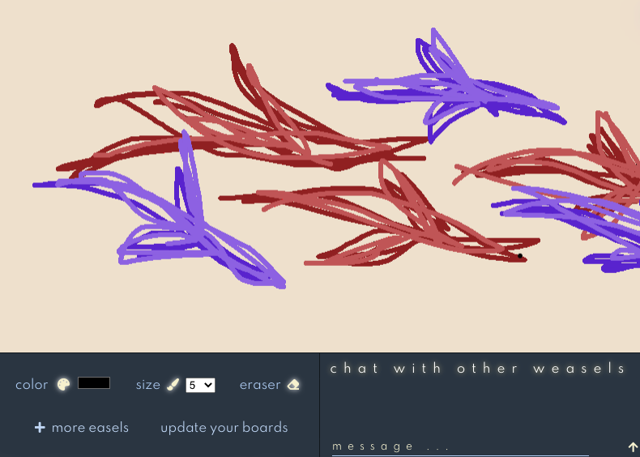
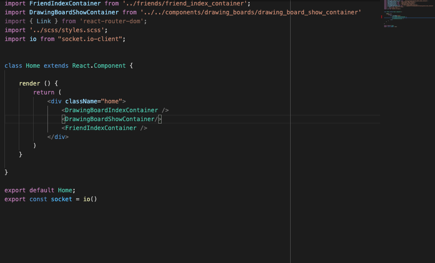
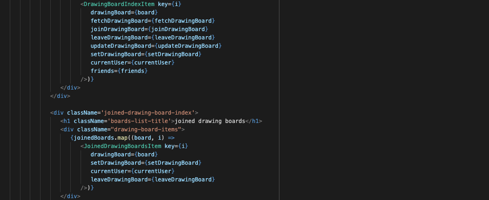
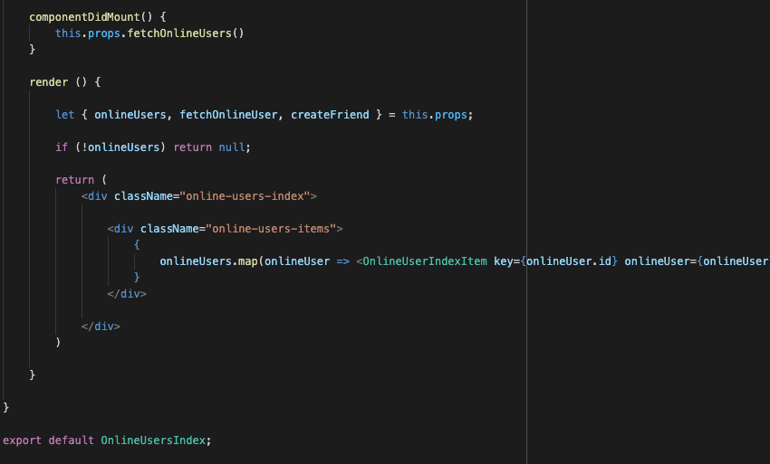

# Weeasel

[Link to live site](http://weeasel.herokuapp.com/#/)

## Overview
Weeasel is a collaborative drawing board app that updates users in real time.

Weeasel bolsters the user-experience with great CRUD, a sleek and aesthetically pleasing user interface as well as an intelligible backend to handle and display user data.

The live app also facilitates an even better user experience by implementing a behind the scene save feature that lets you come back to your masterpiece as well as a chat section for each individual board.

## How does it work?

Users have the ability to create and login to their account where they will be prompted to create a drawing board. A drawing board is basically just a pseudonym for a chat room where you can can draw and talk with friends.

Users also have the ability to add people to their friends list by just clicking the plus sign next to friends located in the right side bar which shows all the users for the site.

Once a drawing board is made you will be prompted to enter a name for your easel and begin on your masterpiece.

Now all thats left is to add friends to your board by clicking the icon next to your board name in the sidebar display. Happy Painting!!

## Who is it for?

The most sophisticated and well seasoned artists, or someone who just wants to have some fun with their friends, creating a memory that they can cherish as long as the site stays up.

## Technologies Used 

Weeasel is MERN-stack web application, that takes advantage of websockets. MERN handles all of the user data and visualization while Websockets allows for an almost instantaneous update time for clients connected to the server.

### Websockets 

The web app makes use of the 'socket.io' and 'socket.io client' dependencies. The first sets up a bi-directional communcation system to our already established express server. The seconds allows us to establish a connection on the frontend to essentially just emit messages to the server and then to all clients connected.

### MERN Stack
The web app utilizes MongoDB, Express.js, React.js and Node.js. User's info as well as image data is stored using a non-relational database with documents that are essentially just javascript objects while react renders everything to the screen through a single page model. 

## Implementation details

### Websockets

Once a client logs in they will immediately be connected to the server and ready to emit and receive emits through the io() function.

### MongoDB/Mongoose? 

### React and Redux 

React allows a quick and efficient deployment with its knack for code reusability through the passage of props resulting in a more DRY code base.

Redux ensures a fast load time especially when partnered with life-cycle methods to pre-load data that will be saved in the front end simeoultanesouly cutting down on backend requests. 

## Design Documents

[Link to proposal](https://github.com/samantha-lilly/weeasel/wiki)

